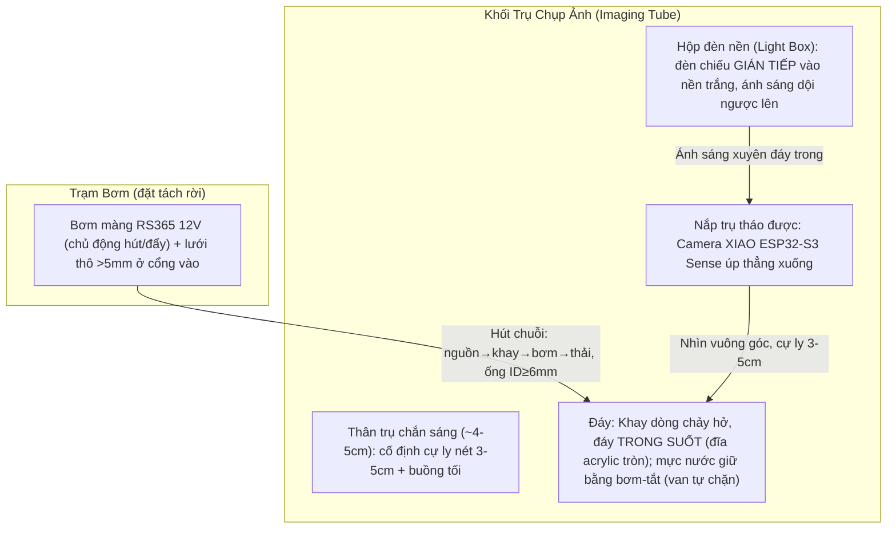

# Aqua Scope — Trạm Quan Trắc & Đếm Hạt/Rác Thải Vĩ Mô Trong Dòng Chảy (1mm–5mm)

Aqua Scope là dự án chuyển đổi cụm camera của kính hiển vi mini (**XIAO ESP32-S3 Sense**) thành một **trạm chụp ảnh và đếm hạt tự động** đặt trong một **khối trụ chắn sáng**, camera nhìn thẳng xuống một **dòng chảy nước hở** để **phát hiện, đếm và đo kích thước** các hạt nhựa/rác thải vĩ mô cỡ **1mm – 5mm**.

> **Phạm vi trung thực về vật lý:** Hệ này **đếm và đo kích thước hạt/rác trong dòng chảy** bằng ảnh bóng đổ (silhouette). Nó **không** phân biệt hóa học "hạt này là nhựa hay không phải nhựa" — việc đó cần nhuộm huỳnh quang (Nile Red) và được ghi nhận là **hướng mở rộng tương lai**, không nằm trong baseline.

---

## 🎯 Bối Cảnh Ứng Dụng (Use Case)

**Kiểm soát chất lượng nước đầu vào cho nhà máy chế biến thực phẩm.** Hệ được đặt ở **điểm lấy nước đầu vào**, kiểm tra nước **trước khi** đưa vào dây chuyền sản xuất, nhằm phát hiện và định lượng hạt/rác vĩ mô (1–5mm) lẫn trong nguồn nước.

Đặc điểm bối cảnh này định hình các quyết định thiết kế:

| Đặc điểm bối cảnh | Hệ quả cho thiết kế |
|---|---|
| **Mẫu ổn định** (nước máy/nguồn cấp, không phải nước thải bẩn biến động mạnh) | Nền sáng đều và ngưỡng hóa (threshold) cố định là đủ tin cậy; không cần bù trừ nền phức tạp. |
| **Lấy mẫu định kỳ** (theo lô/theo ca, không phải giám sát liên tục 24/7) | Chu trình **Stop-Flow** rất hợp: mỗi lần đo là một mẫu rời rạc, có thời gian settle; không cần throughput cao. |
| **Yêu cầu truy xuất nguồn gốc (traceability)** | **Bắt buộc**: mỗi lần đo phải gắn **mã mẫu / timestamp / số hạt / phân bố kích thước** và **lưu lại (log)** để đối chiếu về sau. Đây là yêu cầu chức năng mới, không chỉ "đếm là xong". |

> **Lưu ý phạm vi:** đây là kiểm nước đầu vào của nhà máy thực phẩm, **không phải** thiết bị đạt chuẩn an toàn thực phẩm/y tế được chứng nhận. Baseline là **rig demo/phòng lab** minh họa quy trình kiểm định, không phải thiết bị thương mại đã kiểm chuẩn.

---

## 📌 Tiêu Chí Cốt Lõi (3 KHÔNG)

1. **KHÔNG chỉnh sửa thấu kính**: Giữ nguyên lens gốc. Thực nghiệm cho thấy lens gốc OV2640 **tự lấy nét macro sắc nét ở cự ly 3–5cm** — nên chỉ cần đặt mẫu đúng khoảng cách đó, **không cần vặn hay thay lens**.
2. **KHÔNG dùng chip vi lưu kín**: Hạt 1–5mm sẽ làm tắc/rò các kênh micron của flow-cell kín (như [pone.0244103.pdf](file:///c:/University/Semester%204/IOT102/project/pone.0244103.pdf)). Thay bằng **khay dòng chảy hở (Macro-Flow Stage)** + **mực nước cố định bằng mép tràn (weir)** và (tùy chọn) một **cửa sổ kính phẳng cố định** để làm phẳng mặt nước.
3. **KHÔNG can thiệp thủ công**: Bơm, chiếu sáng, chụp ảnh, đếm và xả đều tự động. *(Ngoại lệ thực tế: cần vệ sinh định kỳ chống bám bẩn/tảo khi dùng ngoài thực địa — hệ baseline định vị ở mức demo/phòng lab.)*

---

## 🏗️ Kiến Trúc Vật Lý

Khối trụ chắn sáng **ngắn** (~4–5cm), camera úp xuống từ nắp trụ, đèn nền trắng khuếch tán chiếu ngược từ dưới đáy khay trong suốt lên.



### Vai trò của khối trụ (xương sống của hệ, không phải cái vỏ)
1. **Thước đo (datum):** cố định **cứng** cự ly camera↔nước → giữ **mm/pixel** ổn định → đo kích thước hạt đúng.
2. **Buồng tối:** chắn ánh sáng môi trường → phơi sáng ổn định, ngưỡng hóa (threshold) đáng tin.
3. **Chân máy:** tiết diện lớn, ngắn → cứng, chống rung → ảnh nét, khung hình không lệch.
4. **Nhà đèn:** giữ đèn nền + thành trong **sơn đen nhám** để hút phản xạ lạc.

Chuỗi phụ thuộc: `chiều cao ống → cự ly camera-nước → FOV → mm/pixel → hạt nhỏ nhất thấy được`. Vì lens nét ở 3–5cm nên ống ngắn ~4–5cm; ở cự ly này khay **lấp gần đầy khung hình** và **1mm ≈ 14–35 pixel** (tùy độ phân giải ảnh), thừa để đếm.

> **🔒 Hình dạng & lắp nắp (chốt):** thân trụ là **ống trụ THẲNG**, đường kính ngoài **bằng đúng footprint của base Matchboxscope ĐÃ IN (~50×52mm)** — **KHÔNG phình rộng thành "cốc"**, và **nắp trụ chính là base đã in** (tái dùng nguyên bản, bắt vít qua lỗ sẵn), không dựng nắp mới. Thử nghiệm cho thấy ống thẳng cho ảnh **không kém** ống rộng — chất lượng silhouette do **nội thất đen nhám + phơi sáng tay** quyết định, không do bề rộng ống. Vì nắp (base) chỉ ~50mm nên khay/cửa sổ acrylic/đèn nền **co theo cho lọt lòng ống** (`tube_id`≈46mm → vùng nước ảnh hóa ~40mm, vẫn lấp gần đầy khung, 1mm ≥ ~13px ở VGA).

---

## 🔬 Chiếu Sáng: Bóng Đổ Nền Sáng (Backlit Silhouette)

Đèn LED **trắng** đặt **dưới** đáy khay trong suốt, chiếu ngược lên qua nước. Hạt hiện thành **bóng đen sắc nét trên nền sáng đều**. Đây là kỹ thuật đo hạt kinh điển (shadowgraphy).

### Hộp đèn nền (Light Box) — "LED XUÔI" + buồng trộn + màng khuếch tán xếp lớp

> **🔒 CHỐT 2026-07-07 (thay phương án "bounce/baffle" cũ):** dùng **"LED xuôi"** — module LED
> dựng đứng, **đầu LED hướng THẲNG LÊN**, phía trên có **buồng trộn ~8mm** rồi **màng khuếch tán
> xếp lớp** (giấy can/mica mờ, thêm/bớt lớp chỉnh độ tán) ngay dưới đáy khay. Lý do: test thực tế
> với khuếch tán lớp giấy cho kết quả chấp nhận được; nước cấp nhà máy sạch/ổn định nên nguồn xuôi
> là đủ, kết cấu đơn giản hơn hẳn bounce. (Chi tiết: `thiet_ke_hop_den_nen.md`.)

Kết cấu xếp lớp từ dưới lên:

```
        [ Đáy khay: ĐĨA ACRYLIC trong suốt ]   ← hạt nằm trên đây
   ┌────────────────────────────────────┐
   │  MÀNG KHUẾCH TÁN xếp lớp 0–4mm      │  ← giấy can / mica mờ (chỉnh được)
   ├────────────────────────────────────┤
   │  BUỒNG TRỘN ~8mm (khử hotspot)      │
   │            ▲ LED                    │  ← module LED móc khoá 37.5×10×16
   │       [vách đỡ RỜI, 2 ốc M3 ngang]  │     dựng đứng, đầu LED hướng LÊN,
   │        nửa pin dưới vách            │     cắm-tháo ma sát qua lỗ vách
   └────────────────────────────────────┘
        vành đáy ống = chân đế (hở giữa để thay pin/thao tác)
```

- **Cả module móc khoá = "1 bóng"**: xỏ qua lỗ giữa vách đỡ (khe +0.4mm, giữ ma sát, không keo).
- **Vách đỡ là MIẾNG RỜI** nằm giữa lòng ống, bắt **2 ốc M3 xuyên ngang thành ống** — tháo 2 ốc
  là gỡ cả vách + module.
- **Mặt trong khoang đèn TRẮNG mờ** (khác thân trụ quang học đen nhám) để sáng đều thêm.
- **Màng khuếch tán là lớp bắt buộc**: nguồn điểm → nền xám đều; camera không bao giờ thấy LED trần.

### Bắt buộc để không bị cháy sáng (đúc kết từ thực nghiệm)
- **Khuếch tán** ánh sáng qua tấm mờ (acrylic mờ / giấy can) → nền **xám đều**, không có đốm chói.
- **Phơi sáng thủ công** trên firmware: **tắt AEC (auto exposure), tắt AEC DSP, tắt AGC (auto gain)**, đặt **Gain = 0** và **Exposure thấp**. *(Nếu chỉ kéo thanh Exposure mà chưa tắt AEC/AGC thì cảm biến ghi đè → luôn cháy trắng.)*
- **Vùng sáng lấp đầy khung hình**, tránh viền đen lớn (viền đen vừa phí pixel vừa đánh lừa auto-exposure).
- **Nếu dùng đèn pin mini (kiểu lồng đèn):** độ sáng yếu dần khi pin cạn → khóa phơi sáng tay rồi chỉnh Exposure khớp độ sáng thực; nếu đèn RGB/nhấp nháy thì **phải đặt về trắng tĩnh (static white)**, màu đổi sẽ làm nền chập chờn hỏng ảnh.

### Giảm cường độ khi sáng quá mạnh
- **Khuếch tán/làm đều:** 1–2 lớp **giấy can** hoặc **mica mờ** (mica bền hơn giấy khi gần nước; giấy dễ ẩm, cong).
- **Giảm độ sáng:** chồng thêm **giấy trắng thường** hoặc **phim ND (Neutral Density)** (ND giảm sáng không đổi màu).
- **Cách "sạch" nhất — hạ dòng đèn:** dùng **PWM/chiết áp/điện trở lớn hơn** để chỉnh vô cấp, ưu tiên cách này để tinh chỉnh cuối. *(Làm trước hết vẫn là khóa phơi sáng tay — nhiều ca "cháy sáng" là do AEC/AGC chứ không phải đèn quá mạnh.)*

---

## 🌊 Hệ Dòng Chảy (đơn giản, không kẹt)

- **Dòng chảy do BƠM CHỦ ĐỘNG** (không dựa trọng lực): một **bơm màng RS365 12V** (tự mồi) đặt ở **đầu ra**, hút cả chuỗi **nguồn → khay → bơm → thải**. Bật bơm thì nước (và hạt) bị kéo qua; **tắt bơm** thì **van 1 chiều trong bơm tự bịt, GIỮ NGUYÊN mực nước** để settle — **không cần mép tràn/standpipe để giữ mực** (xem ghi chú "Giữ mực & chống đọng").
- Nước mẫu + hạt vào khay qua **ống rộng** + **lưới thô khe >5mm** ở cổng vào (chỉ **chặn rác to** như lá/cành, **không lọc mất hạt cần đo**).
- **Nước luôn vào–ra qua cổng ở THÀNH BÊN** (theo phương ngang), **không đổ từ trên xuống băng qua cửa sổ** — tránh che tầm nhìn camera và tránh khuấy động mặt nước. Đĩa acrylic ở đáy chỉ có **nước đứng yên bên trên và ánh sáng bên dưới**.
- **2 cổng thành bên, ĐỐI TÂM 180°** để dòng quét ngang TOÀN sàn: (1) **VÀO** — biến tia thành **màng rộng sát đáy** bằng **khe khuếch tán (~18–22mm × ~3mm)** để xóa 2 thùy tĩnh hai bên và quét mặt đáy; qua lưới >5mm nối **nguồn mẫu**. (2) **RA — cổng rút SÁT ĐÁY** (KHÔNG phải ở đỉnh 6mm) nối **ống hút bơm RS365 → thải**, để lúc flush hút được cả **hạt CHÌM (PET/PS) nằm ở đáy**.
- **Mực nước 6mm** do **thời lượng bơm + van bơm tự chặn** ấn định. **Mép tràn (weir) hạ xuống vai trò TÙY CHỌN** (chặn-tràn an toàn khi fill + mực lặp lại), không còn là cơ cấu bắt buộc. **Van xả đáy** cũng tùy chọn (xả cạn/vệ sinh).
- **Chống đọng — yêu cầu duy nhất của khay là "mọi hạt phải RA HẾT, không sót":** **bo fillet R≥2.5mm** góc đáy–thành; **mặt đĩa acrylic phẳng bằng sàn + silicon vê tròn** mối nối để xóa rãnh bẫy hạt; **TUYỆT ĐỐI không lưới/gờ giữ hạt** (việc "giữ hạt lúc chụp" là do **bơm TẮT**, không do cơ học). Flush = **bơm chạy mạnh** (vận tốc khay ~10 cm/s ≈ Q ~1.4 L/min) đủ nhấc cả hạt nổi lẫn chìm ra cổng RA. **Kiểm bằng thả ~20 hạt rồi đếm hạt sót.**
- Ống **ID ≥ 6mm (≥3× hạt 2mm)** để không kẹt; nút hẹp thật sự là **van 1 chiều trong bơm** (bệ ~2–4mm). **Bơm tách rời khối quang** để cách ly rung chấn; nối khay bằng **ống của bơm RS365 đường kính 8mm** *(mặc định hiểu là ID danh nghĩa ~8mm → cổng/ngạnh khớp 8mm; nếu 8mm là OD thì ID~6, cần xác nhận)*. Điện: RS365 12V qua **MOSFET IRLZ44N + diode flyback 1N4007 + tụ 470–1000µF**, nguồn **adapter 12V/2A**, ESP32 nuôi riêng (USB 5V hoặc buck 12V→5V), **chung GND**.

### Độ dày lớp nước (~6mm) — vì sao phải MỎNG
Hạt nhựa **nổi HOẶC chìm** (PE/PP nổi ở mặt nước; PET/PS chìm ở đáy acrylic) → hạt nằm ở **2 mặt phẳng** cách nhau đúng bằng độ dày nước. Giữ nước **mỏng** để:
- **Cả hạt nổi lẫn hạt chìm cùng nằm trong vùng nét (DOF)** — nước sâu thì một trong hai lớp bị nhòe → đo sai kích thước.
- **Chống hạt xếp chồng theo phương đứng** (2 bóng đè nhau → đếm sai); nước mỏng ép hạt thành gần-một-lớp.

Sàn dưới = **hạt lớn nhất 5mm + ~1mm dư ⇒ chọn ~6mm**. Kèm theo: **lấy nét ở GIỮA lớp nước (~3mm)** để hạt nổi/chìm cách mặt nét đều nhau; và **phải kiểm DOF trên phần cứng thật** — nếu DOF của lens gốc ở 40mm < 6mm thì hạt nổi sẽ nhòe → hạ xuống 5mm (tham số hóa).

### Vì sao chuyển sang bơm màng chủ động (bỏ nhu động 28BYJ-48 + bỏ trọng lực)
Bơm nhu động 28BYJ-48 (tham khảo Planktoscope Mini) **bị loại vì quá chậm**: hộp số 1/64 → trục ra ~10–15 RPM, kịch trần ~40 RPM (mô-men sụt theo bậc), lưu lượng thực chỉ **vài mL/phút** → đổ đầy khay 7–10 mL mất **hàng phút**, trong khi ESP32-S3 xử lý xong tức thì. Bơm là **nút cổ chai duy nhất**. Ép nó nhanh (full-step, quá áp, bỏ hộp số) đều đi ngược bản chất "định lượng lưu lượng thấp".

Baseline dùng **bơm màng RS365 12V chủ động** cho toàn bộ fill/flow/flush:

| Việc | Ai làm |
|---|---|
| Cấp mẫu **VÀO** + tạo dòng | **Bơm RS365** hút chuỗi nguồn→khay→bơm→thải |
| **Giữ mực nước** khi chụp | **Van màng bơm tự chặn khi TẮT** (mép tràn = tùy chọn chặn-tràn, không bắt buộc) |
| **Xả/flush hạt** ra ngoài | **Bơm RS365** chạy mạnh/lâu hơn, cuốn hạt (nổi + chìm) ra **cổng ra sát đáy** → thải |

> **Đánh đổi (ghi trung thực):** dòng chủ động khiến **hạt đi qua bơm** ở phía cổng ra — khác thiết kế gốc *"hạt không bao giờ qua bơm"*. Chấp nhận được vì **phạm vi test là hạt < 2mm**, nhỏ hơn nhiều bệ van màng (~2–4mm). Nếu sau này quay lại dải 5mm thì **phải xét lại** (5mm cứng sẽ kẹt van). Bơm chìm 5V bị loại vì phải ngâm nước (khuấy mặt nước + phơi nhiễm hạt) và **cháy khi chạy khô**.

### Cấu tạo đáy khay: đĩa acrylic tròn + chống rò
Đáy trong suốt dùng **đĩa acrylic (mica) TRONG** cắt tròn làm "cửa sổ". Nhựa in 3D **không cho sáng xuyên đều** (các lớp in tán xạ), nên chỉ dùng in 3D làm **khung đen chắn sáng**, còn cửa sổ sáng là **tấm trong rời lắp vào**. **Chọn acrylic thay lam kính** vì lam kính cố định kích thước (rộng chỉ 26mm) không phủ được khay tròn Ø40 → phải bóp vùng ảnh nhỏ; **acrylic cắt được đĩa tròn Ø bất kỳ** nên **giữ nguyên khay tròn, vùng ảnh lấp đầy khung**. Chụp silhouette không cần độ trong quang học cao (hạt nằm ngay trên tấm, đèn đã khuếch tán) nên acrylic thừa trong.

> **Tách 2 lớp — đừng gộp:** cửa sổ đáy = **acrylic TRONG** (để bóng hạt nét); tấm khuếch tán = **mica MỜ/giấy can RIÊNG** đặt bên dưới (để đều sáng). Hai chức năng, hai tấm.

Kiểu lắp **gờ đỡ + vòng ép + silicon**:

```
   mặt cắt cạnh khay:
   ┌── vòng ÉP (retainer, vặn vít/ngàm cài) ──┐
   ═════════ ĐĨA ACRYLIC TRONG ═════════       ← ép giữa 2 lớp
   ░silicon░                        ░silicon░   ← keo silicon hồ cá
   └─ gờ KÊ (ledge) ─┐        ┌─ gờ KÊ ─┘
        thành nhựa in 3D (đen mờ)
```

- **Kích thước đĩa:** cắt **Ø hơi lớn hơn miệng khay** (VD Ø42 cho khay trong Ø40, lọt bore ID46) để có mép chồng lên gờ; **dày 2–3mm** (đĩa Ø~42 không võng), ưu tiên **acrylic đúc (cast)**.
- **Gờ kê (ledge):** hốc lõm quanh miệng khay, ăn vào trong ~2.5mm, sâu ≈ (độ dày đĩa + ~0.3mm cho silicon).
- **Chống rò:** bơm viền mỏng **silicon trung tính (keo hồ cá)** lên gờ **trước khi** đặt đĩa, ấn nhẹ cho dàn đều. **KHÔNG dùng keo 502/cyanoacrylate** — hơi keo làm **acrylic mờ trắng (fogging)**. Không lau bằng dung dịch gốc amoniac (gây rạn).
- **Giữ cố định:** một **vòng ép in 3D thứ hai** đè lên viền đĩa, bắt **3–4 vít M2.5** hoặc ngàm snap-fit → vừa kín, vừa không cho đĩa trôi/nổi.
- **Dung sai in:** chừa khe **+0.3–0.4mm** quanh đĩa; in khung **đen mờ, mặt trong tối** để chắn sáng lạc.
- **Acrylic dễ xước** → vết xước có thể đọc thành "hạt ảo"; thiết kế cửa sổ là **chi tiết thả-vào thay được**, lau nhẹ bằng khăn mềm.
- Tùy chọn (đúng "3 KHÔNG" #2): thêm **1 tấm phẳng gác trên gờ phía trên** (acrylic hoặc lam kính) làm **cửa sổ ép phẳng mặt nước** — **gác gờ, không thả nổi** (kính/acrylic nặng hơn nước sẽ chìm). Lam kính đang có tận dụng ở đây hoặc để hiệu chuẩn.

---

## ⚙️ Chu Trình Vận Hành (Stop-Flow)

```mermaid
sequenceDiagram
    autonumber
    participant Bom as Trạm Bơm
    participant Den as Đèn Nền Trắng
    participant Cam as Camera (XIAO)
    participant CV as Xử lý ảnh (ESP32-S3)

    Note over Bom, CV: B1: Cấp mẫu
    Bom->>Bom: Bơm RS365 hút chuỗi nguồn→khay→thải, khay đầy tới mép tràn

    Note over Bom, CV: B2: Đóng băng (Settle)
    Bom->>Bom: TẮT bơm 1-2s; van màng bơm tự chặn giữ mực nước, mặt nước phẳng lại

    Note over Bom, CV: B3: Chụp ảnh
    Den->>Den: Bật đèn nền trắng (ổn định)
    Cam->>Cam: Chụp ảnh độ phân giải CAO (SXGA/UXGA)

    Note over Bom, CV: B4: Đếm & Đo + Phân loại (Hybrid)
    CV->>CV: Classical CV: threshold → connected components → centroid + diện tích → đếm & phân bố size; rồi crop từng blob → classifier gán loại hạt

    Note over Bom, CV: B5: Xả mẫu
    Den->>Den: Tắt đèn
    Bom->>Bom: Bơm RS365 chạy mạnh cuốn hạt ra cổng ra → thải, nạp mẫu mới → lặp
```

> **Vì sao PHẢI dừng dòng khi chụp (Stop-Flow là bắt buộc, KHÔNG phải di sản bơm nhu động):** dừng dòng cần cho **quang học + thuật toán**, độc lập với loại bơm:
> 1. **Rolling shutter** của OV2640/OV3660 (mỗi hàng pixel phơi sáng lệch giờ) làm hạt đang trôi **méo hình (skew) + nhòe** → sai phép **ĐO KÍCH THƯỚC**. (Chụp lúc chảy cần global shutter hoặc đèn strobe freeze — hệ này không có.)
> 2. Mặt nước chảy **gợn sóng** → khúc xạ bóng hạt, lệch vị trí/kích thước biểu kiến. Settle 1–2s làm mặt phẳng lại.
> 3. Đếm cần **mẫu RỜI RẠC, thể tích cố định** (1 ảnh = N hạt trong diện tích khay × 6mm) → quy ra nồng độ + truy xuất nguồn gốc.
> 4. Pipeline `threshold → connected components → count` là thuật toán **MỘT KHUNG** → chạy trên dòng đang chảy sẽ **đếm đôi** cùng một hạt.
>
> ⇒ Bơm màng RS365 nhanh **làm Stop-Flow TỐT HƠN** (Fill/Flush chớp nhoáng → chu kỳ ngắn, nhiều mẫu/phút), **không hề làm nó thừa**. Thứ *thực sự* đã lỗi thời (thời nhu động) là logic "trọng lực đổ đầy / bơm chỉ chuyển nước sạch / xả van đáy" — xem `info.txt §5–6`.

---

## 🧠 Xử Lý Ảnh (Hybrid: Classical CV đếm+đo + ML phân loại, on-device)

Baseline dùng **pipeline lai**, tận dụng đúng thế mạnh của ESP32-S3: **classical CV** lo **đếm + đo kích thước** (chính xác, rẻ, không cần train), rồi **classifier nhỏ on-device** lo **phân loại từng hạt là GÌ** — việc mà classical CV không làm được.

**Vì sao KHÔNG để object detection làm hết:** FOMO trên XIAO S3 chạy input ~96×96, ~143ms/~7fps nhưng **chỉ trả centroid, KHÔNG trả kích thước**; ở FOV ~40mm thì 96×96 ≈ 0.42mm/px → hạt <2mm chỉ ~5px, dễ mất hoặc dính chùm sau downsample. Detection thuần sẽ **mất deliverable phân bố kích thước** — thứ classical CV cho gần như miễn phí trên nền backlit tương phản cao.

**Pipeline:**
1. **Chụp phân giải cao** (SXGA/UXGA) → ảnh xám → **ngưỡng hóa** (vùng tối trên nền sáng) → **connected components** → mỗi blob cho **tâm + diện tích → đếm & phân bố kích thước**.
2. **Crop từng blob** → đưa vào **classifier nhỏ** (TinyML, tận dụng lệnh vector AI của S3) → **gán loại hạt**. *(Danh sách lớp cụ thể — ví dụ nhựa / bọt khí / rác hữu cơ / sợi — sẽ chốt sau khi có dữ liệu mẫu thật.)*

**Phần cứng:** chạy **on-device** trên XIAO ESP32-S3 (PSRAM 8MB, 240MHz, có lệnh vector AI). Nhánh CV có thể hạ ảnh về VGA (~14px/mm) cho vừa RAM; classifier chỉ ăn từng crop nhỏ nên nhẹ.

*(Phân biệt nhựa/không-nhựa bằng hóa học vẫn là hướng mở rộng: nhuộm Nile Red + LED 365nm + kính lọc vàng → cấp thêm đặc trưng màu cho nhánh classifier, không thuộc baseline.)*

---

## 🗒️ Lịch Sử Thiết Kế (vì sao baseline hiện tại khác bản đầu)

Bản ý tưởng đầu (huỳnh quang UV + FOMO + kính nổi + cự ly 10–15cm + cột Z-Axis) đã được **sửa lại sau khi kiểm tra vật lý và thực nghiệm**:

| Vấn đề bản cũ | Sửa trong baseline |
|---|---|
| UV không làm đa số nhựa (PE/PP/PET/PS) phát quang; rác hữu cơ lại phát quang | Đổi sang **backlit silhouette** ánh sáng trắng, phát biểu mục tiêu trung thực (đếm hạt, không nhận dạng hóa học) |
| FOMO 96×96 không thấy hạt <2mm, không trả kích thước | **Hybrid**: classical CV đếm+đo (size chính xác) + **classifier** phân loại từng hạt (dùng thế mạnh AI của S3) |
| Kính thủy tinh "thả nổi" sẽ chìm | **Cửa sổ kính cố định + mép tràn** giữ mực nước phẳng |
| Bơm nhu động 28BYJ-48 quá chậm (~vài mL/phút) | **Bơm màng RS365 12V chủ động** lo fill/flow/flush; chấp nhận hạt <2mm qua bơm (đánh đổi có chủ đích) |
| Cự ly 10–15cm + lens gốc → hạt bé, phí pixel, cột conson rung | Thực nghiệm: lens gốc **nét ở 3–5cm** → ống **ngắn, cứng**, khay lấp đầy khung |

---

## 📁 Cấu Trúc Thư Mục

* [info.txt](file:///c:/University/Semester%204/IOT102/project/info.txt): Báo cáo kỹ thuật chi tiết (Tiếng Việt).
* [implementation_plan.md](file:///c:/University/Semester%204/IOT102/project/implementation_plan.md): Kế hoạch dựng mô hình 3D OpenSCAD + bảng hằng số baseline.
* [technical_specs.md](file:///c:/University/Semester%204/IOT102/project/technical_specs.md): Thông số cơ khí trích xuất từ các tệp STL tham khảo.
* `plan.md`: Kế hoạch build mô hình 3D (quyết định chốt G1–G5 + thứ tự + kiểm chứng).
* [`thiet_ke_hop_den_nen.md`](file:///c:/University/Semester%204/IOT102/project/thiet_ke_hop_den_nen.md): Chi tiết thiết kế hộp đèn nền "LED xuôi" (chốt 2026-07-07).
* `HUONG_DAN_LAP_RAP.md`: Tutorial thực thi — từ chi tiết đã in/đã mua → lắp trạm hoàn chỉnh → nạp firmware.
* `ai_model_plan.md`: Kế hoạch tạo & train model AI (classifier phân loại hạt) trong pipeline hybrid.
* `web_plan.md`: Spec+plan gộp bản đầu của web/backend — **đã superseded 2026-07-14**, giữ để tra cứu bối cảnh; nguồn sự thật hiện tại là cặp spec/plan trong `docs/superpowers/` (xem bên dưới).
* `openscad/` **(ĐÃ DỰNG 2026-07-07, tiếp tục sửa)**: mô hình OpenSCAD hoàn chỉnh — `constants.scad` (hằng số + assert),
  `components/*.scad` (bản mới nhất của mỗi chi tiết thắng — vd. `top_cap_004` thay `_001`–`_003`),
  `aqua_scope_assembly_001.scad` (lắp ghép tổng, cờ `explode`/`show_*`/`cam_variant`),
  `print/*.scad → *.stl` (9 chi tiết in, đã kiểm manifold). Kiến trúc **lắp từ đáy**: vỏ 1 ống liền
  (đen trên/trắng dưới), khay + đĩa acrylic + vòng ép snap-fit + màng + vách LED đều luồn/tháo từ dưới;
  2 khe dọc ±X cho ngạnh ống nước (có nút bịt chống lọt sáng). Có biến thể **ESP32-CAM** (`cam_variant=1`)
  song song với bản gốc XIAO.
* [base/](file:///c:/University/Semester%204/IOT102/project/base): STL bệ gốc Matchboxscope — **chính là nắp trụ** (in sẵn, tái dùng nguyên bản, không dựng nắp mới). **Đường kính thân trụ lấy đúng footprint của base (~50×52mm)**, ống THẲNG không phình rộng.
* [perestaltic pump/](file:///c:/University/Semester%204/IOT102/project/perestaltic%20pump): STL bơm nhu động Planktoscope Mini — **chỉ tham khảo, ĐÃ LOẠI** (quá chậm). Baseline dùng **bơm màng RS365 12V** chủ động.
* [`so_do/`](file:///c:/University/Semester%204/IOT102/project/so_do): Sơ đồ tổng quan hệ thống + chi tiết hộp đèn nền (SVG).
* [`firmware/`](file:///c:/University/Semester%204/IOT102/project/firmware): Firmware ESP32. Bản **chính thức**: [`aqua_scope_station/`](file:///c:/University/Semester%204/IOT102/project/firmware/aqua_scope_station) (ESP32-CAM AI-Thinker, port từ `esp32-cam-webserver` easytarget + `/device` audit + lưu cấu hình flash). Các thư mục khác (`aqua_scope_cam/`, `Esp32 cam/`, `esp32-cam-webserver/` repo lồng, `pump_stopflow_test/`) là tiền đề/tham khảo/công cụ test độc lập — xem bảng phân loại trong README của `aqua_scope_station/`.
* [`dataset_collector/`](file:///c:/University/Semester%204/IOT102/project/dataset_collector): Firmware (bản sao của `esp32-cam-webserver`, thêm nút thu dataset vào web UI) + `collect_dataset.py` + `diagnose.py` — công cụ thu ảnh dataset huấn luyện, tách riêng khỏi firmware của trạm.
* [`ml/`](file:///c:/University/Semester%204/IOT102/project/ml): Pipeline detection (Roboflow `microplastics-m7mf5`) — train/export/suy luận (2 nhánh backend Roboflow hoặc local `ultralytics`), `--from-board` chụp thẳng từ board ghi sổ audit. Xem `ml/deploy_options.md` cho 2 hướng deploy (offload PC vs on-device).
* [`web/`](file:///c:/University/Semester%204/IOT102/project/web): Backend FastAPI + dashboard truy xuất nguồn gốc (traceability) — nhận kết quả từ `ml`, phục vụ lịch sử/audit theo mã mẫu. Spec/plan hiện hành ở `docs/superpowers/specs|plans/2026-07-14-web-*`.
* [`Aqua Scope dashboard/`](file:///c:/University/Semester%204/IOT102/project/Aqua%20Scope%20dashboard): Design handoff (HTML/JSX tham chiếu, không phải code sản phẩm) cho dashboard QC ở `web/` — đã hiện thực hoá với vài lệch có chủ đích (SVG server-render thay Chart.js, bỏ Google Fonts/state-simulator).
* [`variants/`](file:///c:/University/Semester%204/IOT102/project/variants): Hướng nghiên cứu thay thế — cảm biến quang tán xạ 1D (photodiode + NeuralCasting), bỏ camera/holography và bỏ Stop-Flow. Không phải baseline, xem `variants/README.md`.
* [`docs/superpowers/`](file:///c:/University/Semester%204/IOT102/project/docs/superpowers): Spec/plan hiện hành theo chuẩn superpowers (`specs/`, `plans/`, `prompts/`) — nguồn sự thật mới nhất cho web, ml, firmware station/dataset-collector, thay cho các file `*_plan.md` rời ở gốc repo khi đã được đánh dấu superseded.
